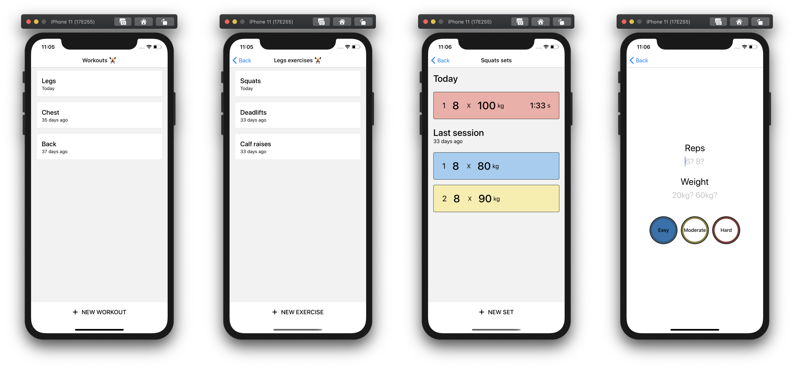
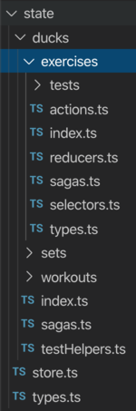

# Simple Gym App

This app is used to track progress in the gym and ensures that every session you are lifting more.

### Features

- Compare last session's results instantly
- Rest timer
- Offline compatibility

### Code structure

*Feature-first* over a *function-first* approach. Inspired by: [re-ducks](https://www.freecodecamp.org/news/scaling-your-redux-app-with-ducks-6115955638be/). 

*Function-first* gives you one `./reducers` folder which contains every reducer from the app. This would be the same for `./selectors`, `./containers`, `./actions`, etc. 

The *feature-first* approach groups all logic related to that feature into one folder.

